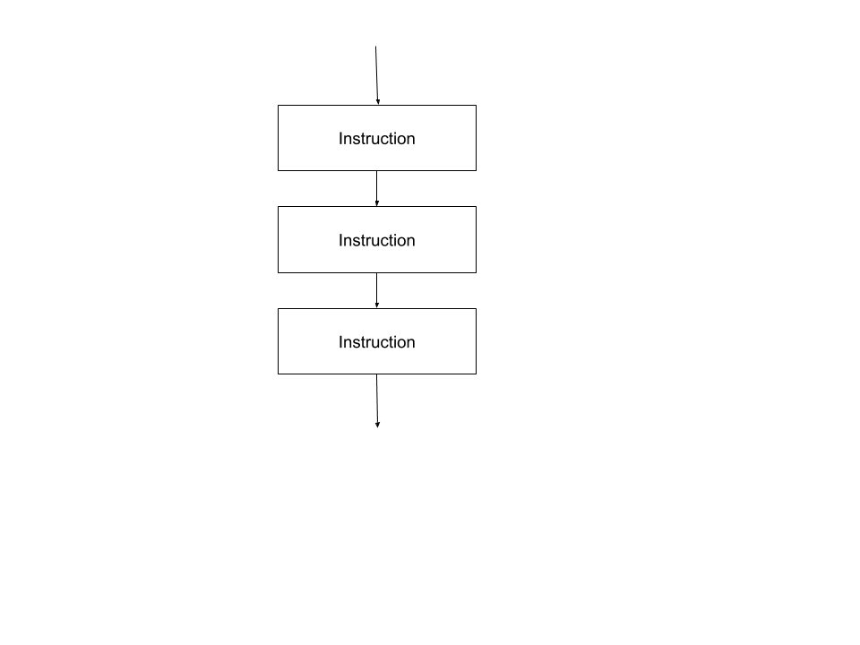
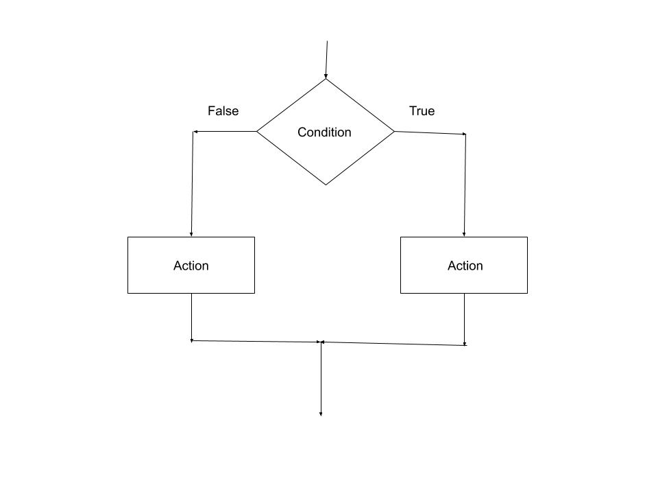
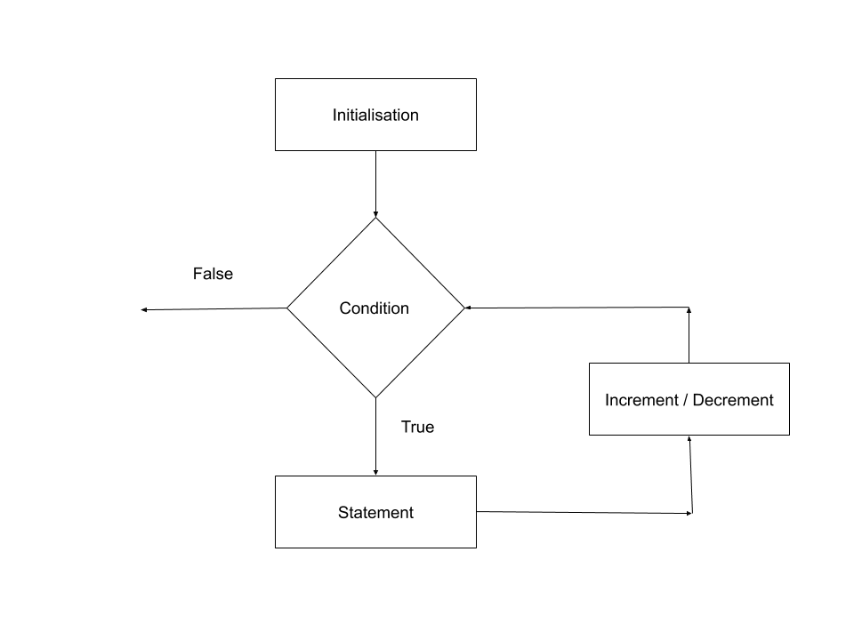

## Building Blocks of Algorithm

An Algorithm is made up of three basic building blocks:
- Sequence
- Selction
- Iteration

## Sequence
Sequential control means that the steps of an algorithm are carried out in a sequential manner, where each step is executed exactly once.
 
```
Example: Algorithm to convert Centigrade to Fahrenheit

Step 1: Read the temperature in degree Centigrade
Step 2: Convert the Centigrade to Fahrenheit using the formula
			F= 9/5 * c+32
Step 3: Print the Celsius and Fahrenheit value
```

## Selection
Algorithms can use selection to determine a different set of steps to execute based on a Boolean expression.If the conditional test is true, one part of the algorithm will be executed, otherwise it will execute the other part of the algorithm.


```
# Example: Algorithm to find Greatest of two numbers

Step 1: Read first numbers A
Step 2: Read second number B
Step 3: IF(A>B) then 
			Print A is big
		Else 
			Print B is big
```

## Iteration
Algorithms often use repetition to execute steps a certain number of times or until a certain condition is met.



```
Example: Print 'Hello world' 5 times

Step 1 : Start
Step 2 : Initialize the value of i as 1
Step 3 : Check the condition i less than or equal to 5, if the condition is true goto step 3.1 else goto step 4
         Step 3.1: Print “Hello World” and increment 
         	         the value of i by 1
         Step 3.2: Repeat the Step 3 until the condition is true
Step 4 : Stop

```

## Youtube
[](http://www.youtube.com/watch?v=vpUFllkLwGU "Building Blocks of Algorithm")


