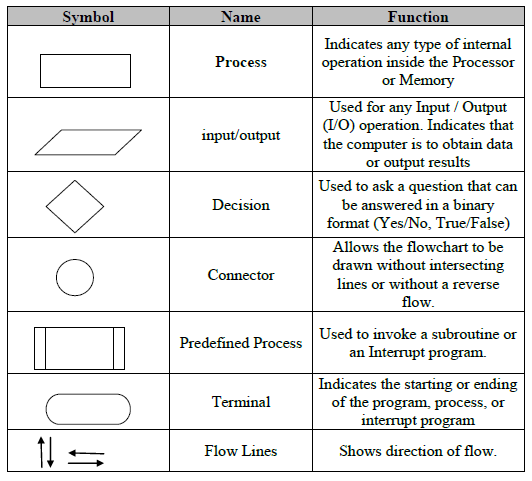

Flow chart is a pictorial representation of an algorithm. Sequential steps in an algorithm can be represented as a flowchart using standard symbols.
## Flowchart Symbols

## Guidelines
- In drawing a proper flowchart, all necessary requirements should be listed in logical order.
- The flowchart should be clear, neat and easy to follow.
- Ensure that the flowchart has a logical start and finish.
- The usual direction of the flow of a procedure or system is from left to right or top to bottom.
- Only one flow line should come out from a process symbol.
- The Decision symbol has two exit points; these can be on the sides or the bottom and one side.
- All boxes of the flowchart are connected with Arrows. (Not lines)
- Flowchart symbols have an entry point on the top of the symbol with no other entry points. The exit point for all flowchart symbols is on the bottom except for the Decision symbol.
- All flowcharts start and end with terminal.
## Youtube

Web Reference:
http://naveenkandwal.blogspot.com/2014/01/flowchart_18.html

