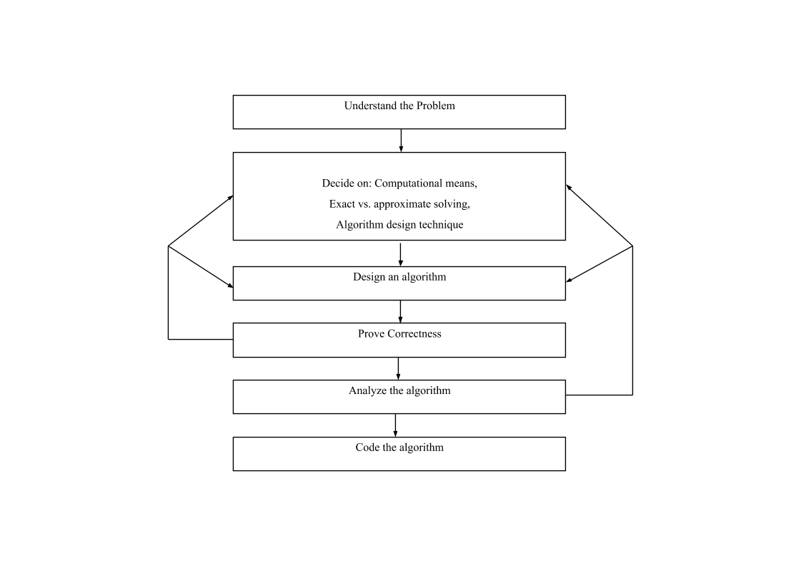

An Algorithm is defined as a set of steps for solving a particular problem in a finite amount of time. It is a good software engineering practice to design algorithms before we write a program.

## Understanding The Problem:
- Before designing an algorithm we have to understand the problem completely.
- An input to the algorithm specifies an instance of the problem the algorithm solves.
- It is very important to specify exactly the range of instances the algorithm needs to handle.

## Ascertaining the Capabilities of the Computational Device:
- The second step is to ascertain the capabilities of the machine.
- Sequential algorithms: Instructions are executed one after another, one operation at a time. 
- Parallel algorithms: computers that can execute operations concurrently, i.e., in parallel. Algorithms that take advantage of this capability are called parallel algorithms.

## Choosing Between Exact and Approximate Problem Solving:
- The next decision is to choose between solving the problem exactly or solving it approximately. Based on this, the algorithm is classified as exact and approximation algorithms.

There are three reasons to choose an approximation algorithm.
- There are important problems that simply cannot be solved exactly for most of their instances; 
	Ex: Extracting square roots, solving nonlinear equations and evaluating definite integrals.
- Available algorithms for solving a problem exactly can be unacceptably slow because of the probem’s intrinsic complexity.
- An Approximation algorithm can be a part of a more sophisticated algorithm that solves a problem exactly.

## Deciding on Appropriate Data Structures:
- Data structures refer to the types of data used and how the data are organized in the program. 
- Data come in different forms and types. Most programming languages provides simple data types such as integers, real numbers and characters, and more complex data structures such as arrays, records and files which are collections of data.
- Algorithm design techniques depend on the structuring data specifying a problem’s instance.
		ALGORITHM + DATASTRUCTURE = PROGRAMS

## Algorithm Design Technique:
An algorithm design technique (or “strategy” or “paradigm”) is a general approach to solving problems algorithmically that is applicable to a variety of problems from different areas of computing.

## Methods of Specifying An Algorithm:
- Pseudo code is an informal way of programming description that does not require any strict programming language syntax. It is used for creating an outline or a rough draft of a program. It is more precise than natural language and its usage is similar to algorithm descriptions.
- Flow chart is a pictorial representation of an algorithm. Sequential steps in an algorithm can be represented as a flowchart using standard symbols

## Proving An Algorithm’s Correctness:
- Correctness has to be proved for every algorithm.
- A common technique for proving correctness is to use mathematical induction because an algorithm’s iterations provide a natural sequence of steps needed for such proofs.
- The notion of correctness for approximation algorithm is less straightforward that it is for exact algorithms.

## Analyzing An Algorithm:
Efficiency is an important character of any algorithm.
There are two kinds of algorithm efficiency:
- Time Efficiency. It indicates how fast the algorithm runs; space efficiency 
- Space Efficiency. It indicates how much extra memory the algorithm need

## Coding An Algorithm:
- Programming the algorithm by using some programming language.
- Formal verification is done for all small programs.
- Validity is done through testing and debugging.
- Inputs should fall within a range and hence require no verification.
- A good algorithm is a result of repeated effort and work.
- The program’s stopping or termination condition has to be set.

References: Introuction to the design and analysis of algorithms - Anany Levitin

