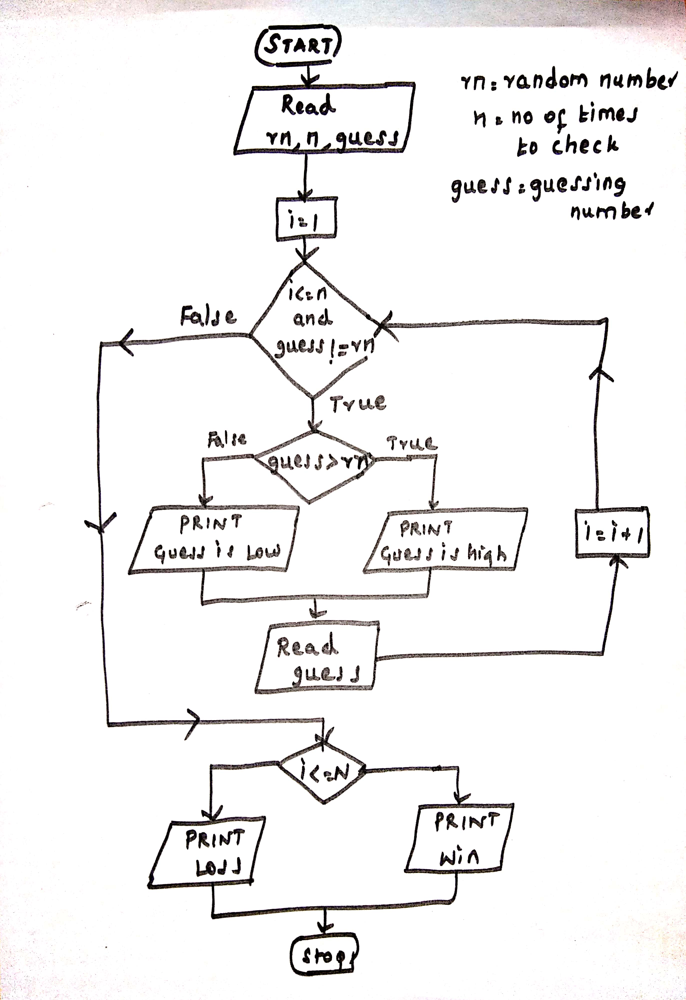

## Problem:
"Guess the Number" game. The computer will think of a random number from 1 to 100, and ask you to guess it. The computer will tell you if each guess is too high or too low. You win if you can guess the number within n tries.

#### Input:
Integer random_number
Integer N denoting no of tries.
Integer guess 

#### Output:
Win or Loss

#### Constraints:
1<= guess <= 100


 
## Algorithm
```
Step1: START
Step 2: Read random_number between the range 1 and 100.
Step 3: Read N
Step 4: Read guess
Step 5: SET i=1
Step 6: WHILE i<=N and guess not equal to random_number
		if guess > random_number then
			PRINT "Guess is high"
		else
			PRINT "Guess is Low"
		Read guess
		SET i=i+1
	    END WHILE
Step 7:IF i<=N then
	   PRINT "WIN"
	ELSE
	   PRINT "LOSS"
Step 8: STOP

```

##Flowchart




