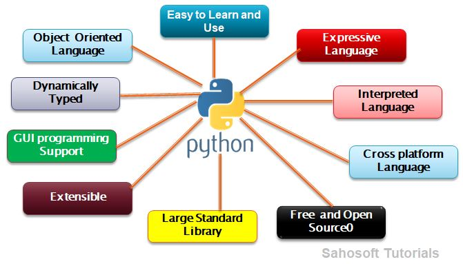

Python is an interpreted, high-level, general-purpose and object oriented programming language.It was developed by Guido Van Rossum in the early 1990s.
Python runs on many Unix variants, on the Mac and on Windows 2000 and later.

## Why Python

- It is omnipresent – people use numerous Python-powered devices on a daily basis, whether they realize it or not. 
- There have been millions (well, actually billions) of lines of code written in Python, which means almost unlimited opportunities for code reuse.
- It is easy to learn – the time needed to learn Python is shorter than for many other languages; this means that it’s possible to start the actual programming faster. 
- It is easy to use for writing new software – it’s often possible to write code faster when using Python. 
- It is easy to obtain, install and deploy – Python is free, open and multiplatform; not all languages can boast that. 
- There is a large and very active Python community. 
- It will give you a solid foundation and allow you to learn other programming languages (e.g., C++, Java, or C) much easier and much faster. 
- Python code is like a pseudo-code.

## Applications of Python
- Web and Internet Development
- Scientific and Numeric
- Education
- Desktop GUIs
- Software Development
- Business Applications
- Game Programming
- Distributed Programming

## Features
** Easy to Learn and Use ** 
- Python is easy to learn. Its syntax is easy and code is very readable. The Python code is very similar to English and pseudo-code.

** Expressive Language ** 
- Expressive in this context means that a single line of Python code can do more than a single line of code in most other languages. The advantages of a more expressive language are obvious – the fewer lines of code you write, the faster you can complete the project.

** Interpreted Language ** 
- An interpreter is a kind of program that executes other programs. When you write Python programs , it converts source code written by the developer into intermediate language (byte code) which is again translated into the native language / machine language that is executed.
- If you are familiar with languages like C, C ++ or Java, you must first compile it and then run it. But in Python it is not necessary to compile it. Internally, the source code becomes an immediate form called byte code. 
- Therefore, all you need to do is run your Python code without worrying about linking to libraries and other things.
- Actually python programs are both compiled as well as interpreted but the compilation part is hidden from the programmer due to reduce the complexity.

** Cross-platform Language **
- Let's say you wrote a Python code for your Windows machine. Now, if you want to run it on Linux, Unix and Macintosh, you do not need to make any changes.
- In other words, you can take a code and run it on any machine, it is not necessary to write a different code for different machines. This makes Python a portable language.

** Free and Open Source **
- The Python language is available for free on the official Python website. And it's open source. Means it’s source code is available to the public. You can download it, change it, use it. That's why it's open source.

** Large Standard Library **
- Python has a large and extensive library and offers a wide set of modules and functions for rapid application development.

** Extensible **
- Python is easily extensible with C/C++/Java code, and easily embeddable in applications.

** GUI Programming Support **
- We can develop GUI (Graphical user interfaces) applications using Python.

** Dynamically Typed **
- Python is a dynamically typed language. Means the type for a value is decided at runtime, not in advance. It is not necessary to specify the type of data when declaring it.
What it does is, It stores that value at some memory location and then binds that variable name to that memory container. And makes the contents of the container accessible through that variable name. 

## Youtube

References:
- https://openedg.org/learn-python-the-language-of-today/
- http://www.sahosofttutorials.com/Course/Python/102/

