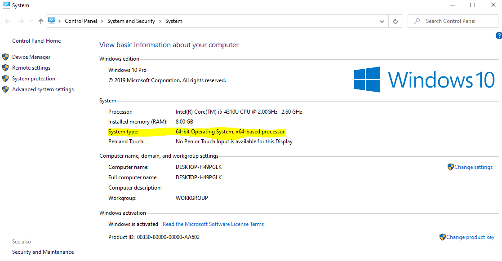
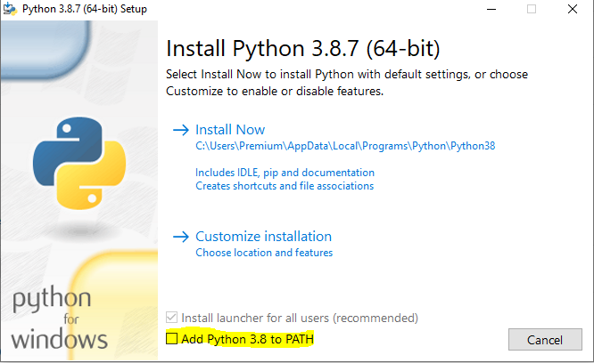

Install python in stand alone computer by downloading the file from the following link.
https://www.python.org/downloads/

## Windows Installation

First check system architecture by right clicking my computer and click properties.Note down your system type and download python according to your system type.

## Download Link

Python 3.8.7 32 bit https://www.python.org/ftp/python/3.8.7/python-3.8.7.exe

Python 3.8.7 64 bit https://www.python.org/ftp/python/3.8.7/python-3.8.7-amd64.exe

For other versions https://www.python.org/downloads/windows/

- check Add Python to PATH and click install

## Youtube

References:
- https://diveintopython3.problemsolving.io/installing-python.html

